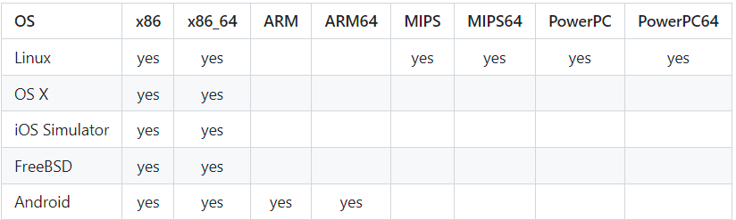

# Fsanitizer
Describe and discuss Address Sanitizer with examples.
## Table of Contents

[Purpose](#purpose)<br>
[What is Address Sanitizer?](#what-is-address-sanitizer)<br>
[Valgrind vs. Address Sanitizer](#valgrind-vs-address-sanitizer)<br>
[Compile Flags](#compile-flags)<br>
[Conclusion](#conclusion)
[References](#references)

## Purpose
- The purpose of this repo is to inform the use case of the GCC compiler flag known as Address Sanitizer.

## What is Address Sanitizer?
- Address Sanitizer was originally made by Google to expedite secure coding practices by reporting errors such as "Use after free" and "Access Null Value".
- After finding its use to be successful and identifying several issues in the developers code, it was eventually built into the GCC standard library.

### Supported Systems
Chart uploaded from AddressSanitizer by google (https://github.com/google/sanitizers/wiki/AddressSanitizer)
<br>

### Reporting Errors Supported
- Use after free
- Heap buffer overflow
- Stack buffer overflow
- Global buffer overflow
- Use after return
- Use after scope
- Initialization order bugs
- Memory Leaks

## Valgrind vs. Address Sanitizer
Valgrind does not replace Address Sanitizer and vice-versa. They both are the near the same tools and have the same goal to solve memory errors. That being said, there is specific reasons one may use Address Sanitizer in lieu of Valgrind. Valgrind is an external library that must be installed to use. While Address Sanitizer is built into the standard library of GCC. Meaning if GCC is not your flavor of compiler, then either Valgrind or Address Sanitizer would have to be installed. Speaking in terms of analysis time, Valgrind is slow vs Address Sanitizer being quicker. If a program requires a very large compilation base or several different lines of code and time is of the essence, Address sanitizer would be a good choice.

That being said, the narritive of the first is obvious pro Address Sanitizer, but there is also a pro Valgrind narritive!

Valgrind is easy to use! It is as easy as making a bowl of cereal and gives an extensive amount of error validation. Valgrind could be used with any compiler while Address Sanitizer can not. Not only is the reason that it can be used on many different compiler flavors a pro, but also the attributes of Valgrind. Valgrind has Helgrind and several thread analysis tools built into it. This is why Valgrind typically runs slower. Valgrind is able to detect deadlocks, races conditions, and thread smashes more efficiently than Address Sanitizer.

That being said, it sounds like if you use them together, then you have the Wonder Twins of memory error detection! That is both true and false. If used at seperate times, you will, but if used at the same compile time you will have false positives of memory errors or being memory error free (BLUF: Do two seperate compiles with the two tools).

## Compile Flags
Below is a Makefile example. A version of this Makefile will be used in the examples showing errors being reported by Address Sanitizer.
```
.PHONY all clean debug valgrind time
CFLAGS := -std=c18 -Wall -Wextra -Wpedantic -Waggregate-return -Wwrite-strings -Wvla -Wfloat-equal -lpthread

CC := gcc
PROJ_NAME := example
TST_DIR := test
TST_SERVER := test_server


SRC := src

SRC := $(wildcard src/*.c)
HDR:= $(wildcard include/*.h)

$(PROJ_NAME): CFLAGS += -D _POSIX_C_SOURCE=200809L	
$(PROJ_NAME): $(SRC)
	$(CC) $(CFLAGS) $^ -o $(SRC)


profile: CFLAGS += -pg
profile: LDFLAGS += -pg
profile: all

debug: CFLAGS += -g3 -fsanitize=address
debug: CFLAGS += -D _POSIX_C_SOURCE=200809L
debug: $(SRC)
	$(CC) $(CFLAGS) $^ -o $(SRC)

clean:
	rm -f $(wildcard $(SRC)/*.c~) && rm -f $(wildcard $(SRC)/*.h~)
	rm -f $(SERVER) && rm -f $(TST_SERVER) && rm -f log_file.txt

valgrind: $(EXE)
	valgrind --leak-check=full --show-leak-kinds=all -s ./$(SERVER)
	
%.o: %.c $(SRC)
	$(CC) $(CFLAGS) -c $< -o $@

time: 
	echo "Can you Teach me how to Makefile?"
 ```
 
 ## Conclusion
 This repo will also provide you with examples of error detection of Address Sanitizer. Test them out, add to them, experiment with your own projects. Do what ever you like with them, but add this to your toolbelt in debugging. Thank you and have a happy memory free program!


## References
http://www.quickmeme.com/Captain-Planet-Approves<br>
https://github.com/google/sanitizers/wiki/AddressSanitizer<br>
https://www.osc.edu/resources/getting_started/howto/howto_use_address_sanitizer<br>
